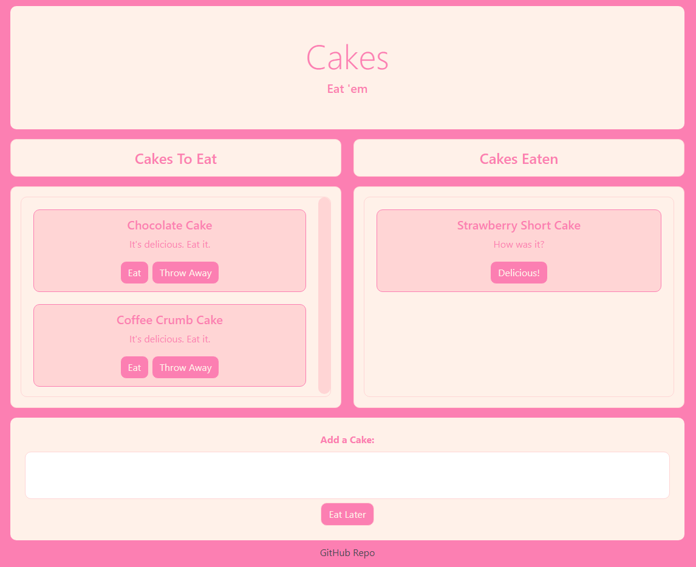

# Cake Muncher
**Technologies Used:** Heroku, Node.js, Express.js, Bootstrap, jQuery, Javascript, Git, GitHub, VSCode, MySQL

## Summary
A site made with Handlebars. It fetches data from a database to display information on the page. When the user clicks on the `Eat Later` button, it adds a new item to the database. Clicking on `Eat` will update that item in the database. Clicking on `Throw Away` or `Delicious!` will delete that item from the database.

## Highlights:
- Deployed to Heroku
- Node.js
- Express.js
- MySQL
- Express Handlebars

## Installation Guide
- Clone this Repository to your computer
- Run npm install inside this folder's directory to install the dependencies
- Configure the connection.js file in /config, so that `user:` and `password:` matches your database
- Import `schema.sql` and `seeds.sql` to your `Database`. I recommend `MySQL` since that's what I used.
- Then simply run the applications in terminal/console: `node server.js`
- Then open https://localhost:3377 on your browser

## Dependencies
- express
- express-handlebars
- body-parser
- mysql

## Goals
- Make random cake images/descriptions to append into the `Cakes To Eat` List


## Learning Experience
- Learned to make a site with Handlebars
- Learned to setup a Database on Heroku
- Learned to create/release connection pools for MySQL

## Screenshots

## Code Snippets
Using handlebars to generate html elements
```
{{#each cakes}}
    {{#unless devoured}}
        <li class="list-group-item">
            <h5 class="cake-title">{{cake_name}}</h5>
            <p class="cake-text">It's delicious. Eat it.</p>
            <button class="btn btn-cake btn-outline-cake eat" data-id="{{id}}">Eat</button>
            <button class="btn btn-cake btn-outline-cake delete" data-id="{{id}}">Throw Away</button>
        </li>
    {{/unless}}
{{/each}}

{{#each cakes}}
    {{#if devoured}}
        <li class="list-group-item">
            <h5 class="cake-title">{{cake_name}}</h5>
            <p class="cake-text">How was it?</p>
            <button class="btn btn-cake btn-outline-cake delete" data-id="{{id}}">Delicious!</button>
        </li>
    {{/if}}
{{/each}}
```
Routing to the handlebar views
```
cakes.get("/", function(req, res) {
    // use cake.all(cb)
    cake.all(function(data) {
        // show that index page!
        res.render("index", { cakes: data })
    })
});
```
Lots of callbacks
```
// in cake.js:
var cake = {
    // all!
    all: function(cb) {
        // use orm.selectAll(table, cb)
        orm.selectAll("cakes", function(res) {
            // callback value
            cb(res);
        })
    },
```
Using pools to close connections after data is retrieved
```
// in orm.js:
var orm = {
    // selectAll()
    selectAll: function(table, cb) {
        // generate query string
        var queryString = "SELECT * FROM " + table + ";";
        // connect
        pool.getConnection(function(err, connection) {
            // query
            connection.query(queryString, function(err, res) {
                // error handling
                if (err) {
                    throw err;
                }
                // callback value
                cb(res);
                // release connection
                connection.release();
            });
        });
    },
```
## Links
LinkedIn: https://www.linkedin.com/in/kerwinhy/<br>
GitHub: https://github.com/seiretsym<br>

## Deployed Site:
Heroku: https://blooming-atoll-30700.herokuapp.com/
